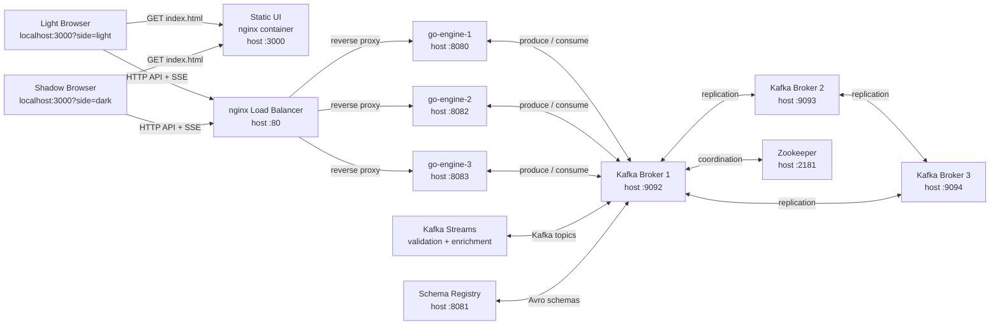
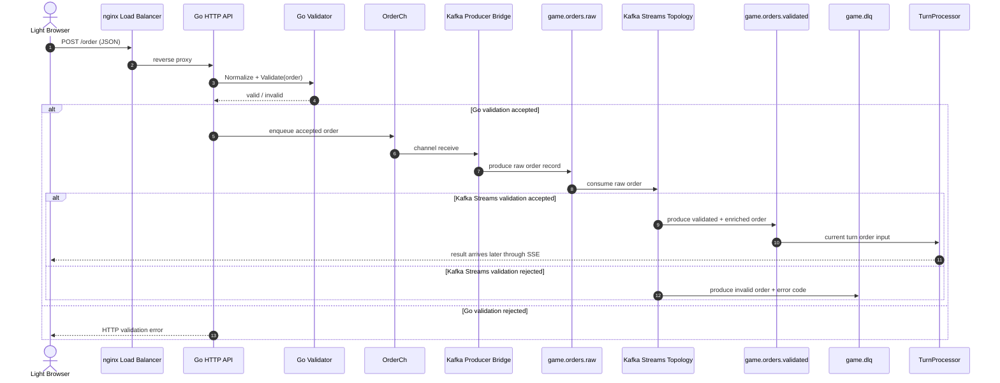
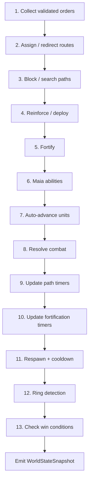
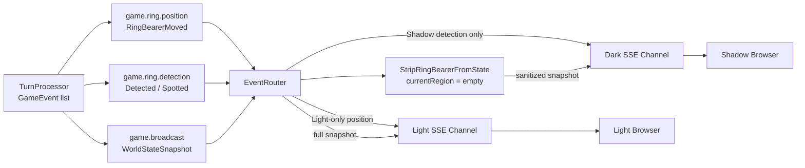
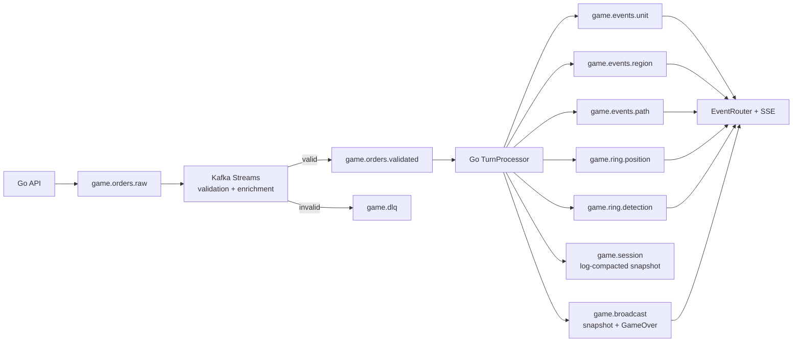
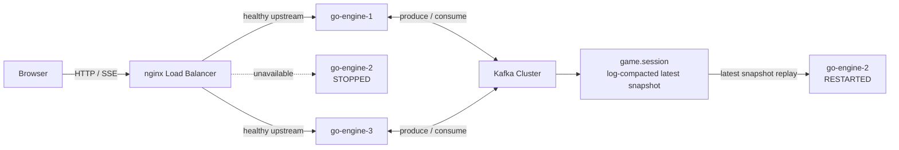
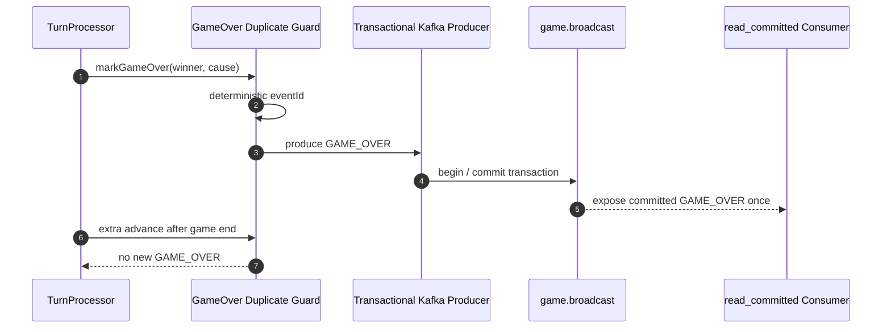

# Ring of the Middle Earth - Teknik Akis Diyagramlari

Bu belge projede "hangi veri nereden nereye gidiyor?" sorusunu teknik terimlerle gorsellestirir.
GitHub, asagidaki Mermaid diyagramlarini otomatik olarak render eder.

---

## 1. Sistem Mimarisi



Sunumda soyle:

```text
Browser UI statik olarak 3000 portundan aciliyor. API ve SSE trafigi nginx load balancer'a gidiyor. Nginx istekleri uc Go engine arasinda dagitiyor. Go engine'ler Kafka uzerinden order, event ve session snapshot akisini kullaniyor. Kafka Streams raw orderlari validate ve enrich ediyor. Schema Registry Avro mesaj semalarini takip ediyor.
```

Onemli port notu:

| Port | Servis |
| --- | --- |
| `3000` | Browser UI |
| `80` | nginx load balancer |
| `8080` | `go-engine-1` |
| `8081` | Schema Registry; Go engine degil |
| `8082` | `go-engine-2` |
| `8083` | `go-engine-3` |

---

## 2. Player Order Akisi

Ornek: Light oyuncu Frodo icin `ASSIGN_ROUTE` emri veriyor.



Teknik olarak anlat:

```text
Order iki katmanda korunuyor. Go API hizli HTTP validation yapiyor. Kabul edilen order OrderCh kanalina yaziliyor. Producer bridge order'i Kafka'ya tasiyor. Kafka Streams topology de raw order akisini validation ve enrichment islemlerinden geciriyor. Gecerli kayitlar game.orders.validated topicine, gecersiz kayitlar game.dlq topicine ayriliyor.
```

Ilgili kod:

| Sorumluluk | Dosya |
| --- | --- |
| Frontend order payload | `index.html` |
| HTTP endpoint | `option-b/internal/api/server.go` |
| Go validation | `option-b/internal/validation/validator.go` |
| Kafka producer bridge | `option-b/cmd/server/main.go` |
| Kafka Streams topology | `kafka/streams` |

---

## 3. End Turn ve Event Akisi

Oyuncu `End Turn` butonuna bastiginda:

```mermaid
sequenceDiagram
    autonumber
    actor Player as Browser
    participant Nginx as nginx
    participant API as Go API
    participant Loop as Engine Loop
    participant TP as TurnProcessor.ProcessTurn
    participant Cache as In-Memory Cache
    participant Session as game.session
    participant Broadcast as game.broadcast
    participant Router as EventRouter
    participant SSE as GET /events SSE

    Player->>Nginx: POST /game/advance-turn
    Nginx->>API: reverse proxy
    API->>Loop: manual advance signal
    Loop->>TP: ProcessTurn(state, orders)

    Note over TP: 13-step deterministic pipeline
    TP-->>Loop: generated GameEvent list

    Loop->>Cache: apply snapshot / events
    Loop->>Session: produce latest WorldStateSnapshot
    Loop->>Broadcast: produce global events
    Loop->>Router: route side-specific events
    Router->>SSE: fan-out permitted events
    SSE-->>Player: event: message / data: JSON
```

`ProcessTurn` icindeki 13 adim:



Sunumda soyle:

```text
Turn processing deterministic bir pipeline. Emir verildigi anda unit aniden hareket etmiyor. End Turn sonrasi ayni 13 adim her seferinde ayni sirayla calisiyor. Bu siralama movement, combat, detection ve win-condition davranisini test edilebilir hale getiriyor.
```

Ilgili kod:

```text
option-b/internal/game/turn.go
```

---

## 4. SSE ve Information Hiding

Ring Bearer konumu iki oyuncuya ayni sekilde dagitilmaz.



Anlat:

```text
Information hiding frontend CSS ile yapilmiyor. Backend EventRouter Ring Bearer position eventini sadece Light SSE kanalina yollar. Broadcast snapshot Shadow tarafina giderken Ring Bearer currentRegion alani temizlenir. Shadow ancak detection event'i olusursa izin verilen bilgiyi alir.
```

Ilgili kod:

| Sorumluluk | Dosya |
| --- | --- |
| Event fan-out | `option-b/internal/router/event_router.go` |
| State serialization | `option-b/internal/api/server.go` |
| Side-specific view cache | `option-b/internal/cache/cache.go` |
| Browser SSE client | `index.html` |

---

## 5. Kafka Topic Haritasi



Kisa aciklama:

```text
Topicler sorumluluklara gore ayrildi. Bu sayede raw order, validated order, invalid order, unit event, region event, path event, gizli Ring Bearer eventleri ve session snapshotlari birbirinden bagimsiz takip edilebiliyor.
```

---

## 6. Fault Tolerance ve Session Replay



Anlat:

```text
Bir Go engine durdugunda nginx kalan saglikli upstream instance'lara route etmeye devam eder. Kafka event ve session topiclerini saklar. game.session log-compacted topic oldugu icin latest snapshot tutulur. Restart olan engine bu snapshot ile state'e yeniden yaklasir.
```

Dikkatli ifade:

```text
Bu term-project demo seviyesinde fault tolerance kanitidir. Exhaustive production crash-matrix ve her side-effect boundary icin tam replay testi ayrica production hardening kapsamindadir.
```

---

## 7. GameOver Exactly-Once Akisi



Smoke testler:

```powershell
.\scripts\check-gameover-idempotency.ps1
.\scripts\check-gameover-idempotency-dark.ps1
```

Anlat:

```text
Light ve Dark victory senaryolari ayri smoke testlerle oynatiliyor. read_committed consumer GAME_OVER kaydinin sadece bir arttigini kontrol ediyor. Oyun bittikten sonra ekstra advance-turn cagrilari yeni GameOver uretmiyor.
```

---

## 8. Sunumda Kullanilacak En Kisa Diyagram Sirasi

Zaman azsa su uc diyagrami goster:

1. `Sistem Mimarisi`
2. `Player Order Akisi`
3. `SSE ve Information Hiding`

Biraz daha vaktin varsa:

4. `End Turn ve Event Akisi`
5. `Fault Tolerance ve Session Replay`
6. `GameOver Exactly-Once Akisi`

